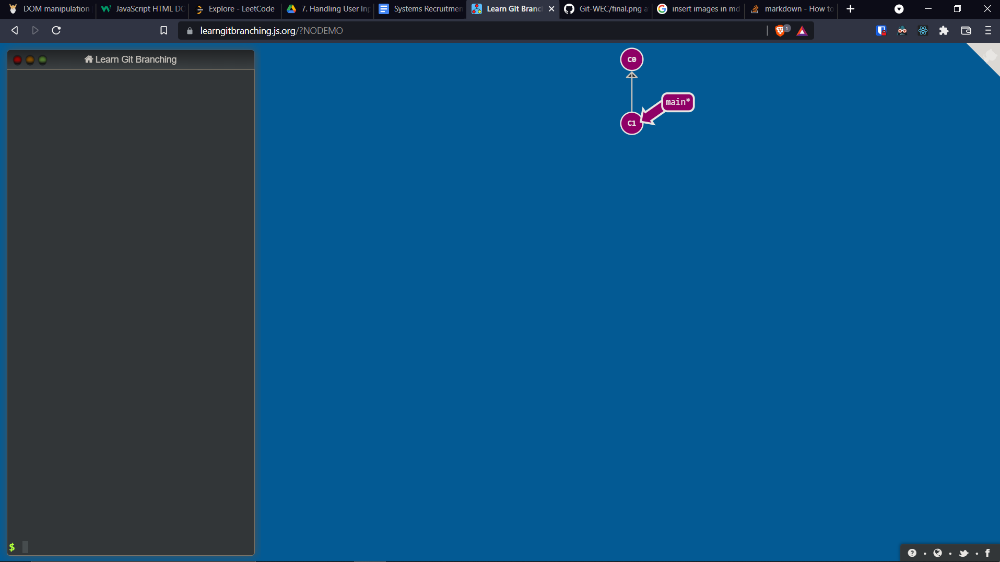
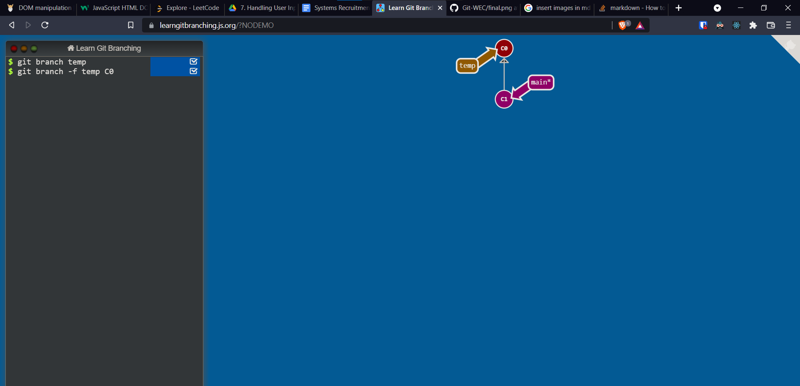
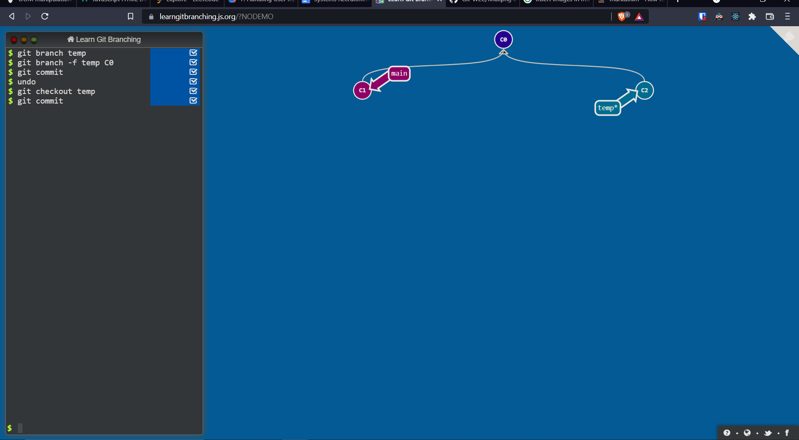
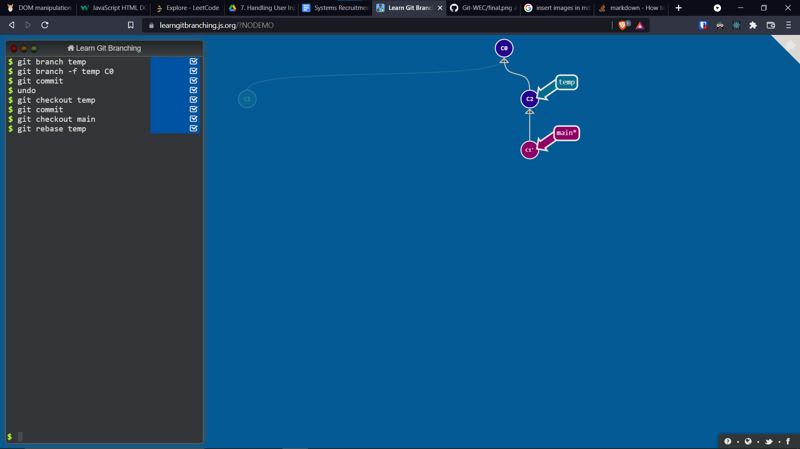

## Steps

1) First a new branch is created by <code>git branch temp</code>
   

2) Then it is made to point to the parent commit by <code>git branch -f temp \<hash of commit\></code>. Then we check it out by <code>git checkout temp</code>
   

3) Now a few dummy changes are made and committed. At this point <code>main</code> and <code>temp</code> have diverged by one commit
   

4) Now we checkout back to <code>main</code>, what we need is to somehow put its commit below the commit in the other branch. For this, we can rebase it with <code>git rebase temp</code>
   

5) Our task is done! The new commit is between the parent and child commits. Athough the hash value of the child commit changed due to rebase, but it is the same commit, just a different hash. And what's in a ~name~ hash?
