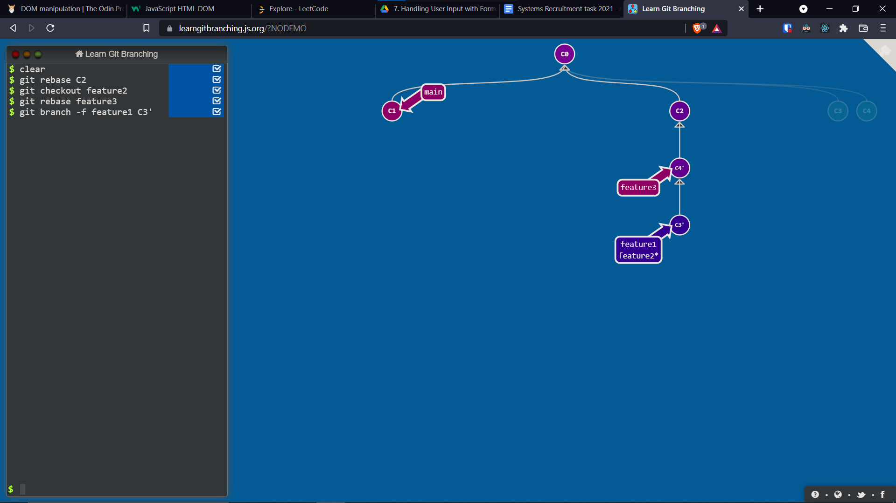

## Steps

1) First I've created the initial workflow layout
   

2) Next we rebase the commits of <code>feature2</code> and <code>feature3</code> into <code>feature1</code>. This is becaise these commits are required later to be a part of <code>feature1</code>. This is done by first <code>git checkout \<branch\></code> to the branch we want to rebase and then <code>git rebase \<branch\></code> to the branch we want to rebase to.
   

3) Now we do an interactive rebase by <code>git rebase -i \<branch\></code> from <code>feature1</code> to <code>main</code> as we want to reorder the commits in desired order also.
   

4) Similar interactive rebases are required for the other branches. Now our new tree structure is ready!
  
