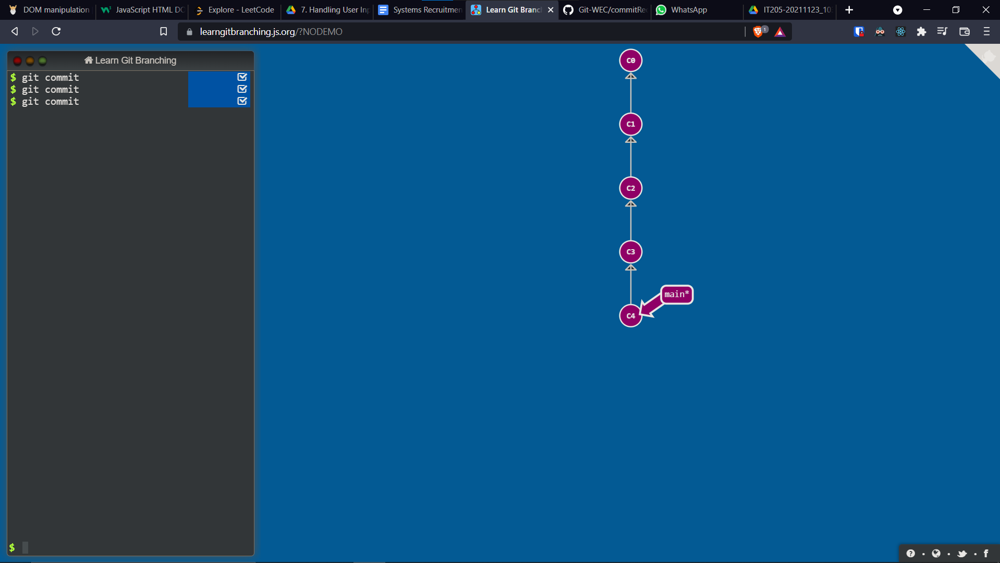
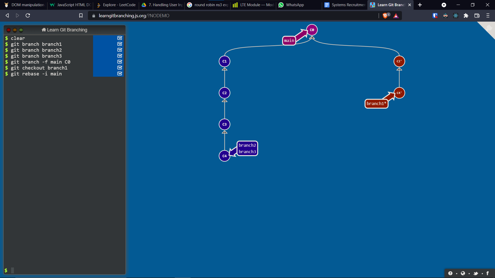
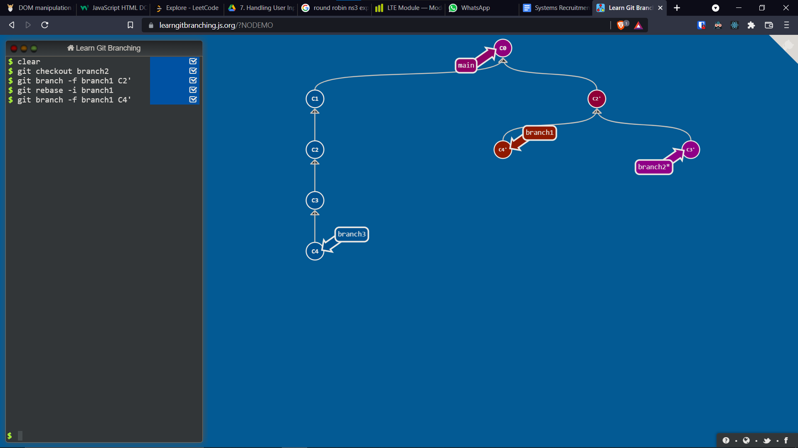
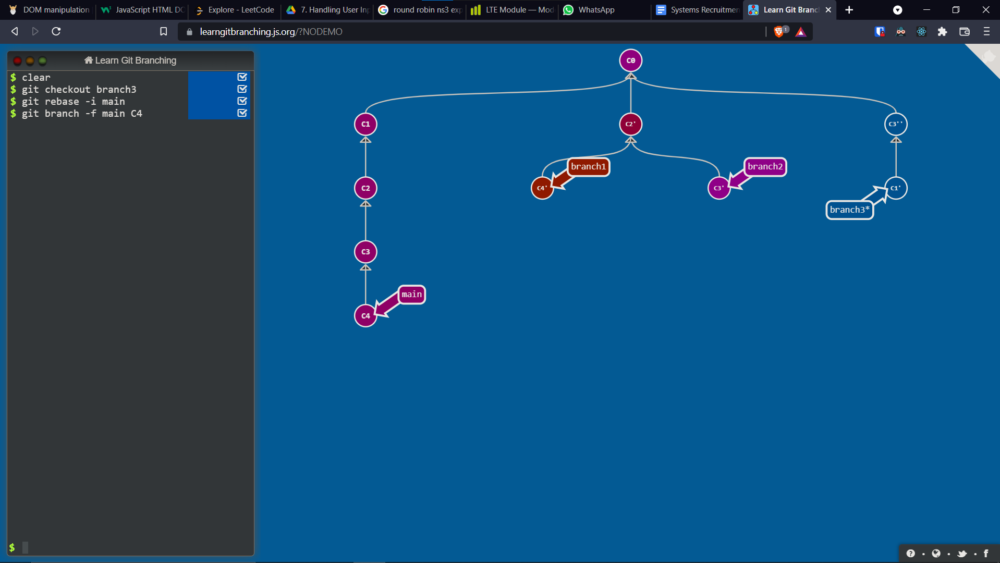

## Steps

1) I create the basic initial tree structure, it is just a linear series of 5 commits on the <code>main</code> branch.
   

2) Next I create three new branches <code>branch1, branch2, branch3</code>. According to the result figure, branch 1 should have the commits third and fifth commit so I first make the <code>main</code> branvh point to the first commit, checkout <code>branch1</code>, and do an interactive rebase to get the required commits.
    

3) <code>branch3</code> is actually a sub-branch of the tree which <code>branch1</code> is a part of. So I first move <code>branch1</code> to the root of its subtree, checkout to <code>branch3</code> and do another interactive rebase to get the desired commits.
    

4) Lastly, I do a similar rebase for <code>branch2</code> and violla! We have the desired tree structure.
    
